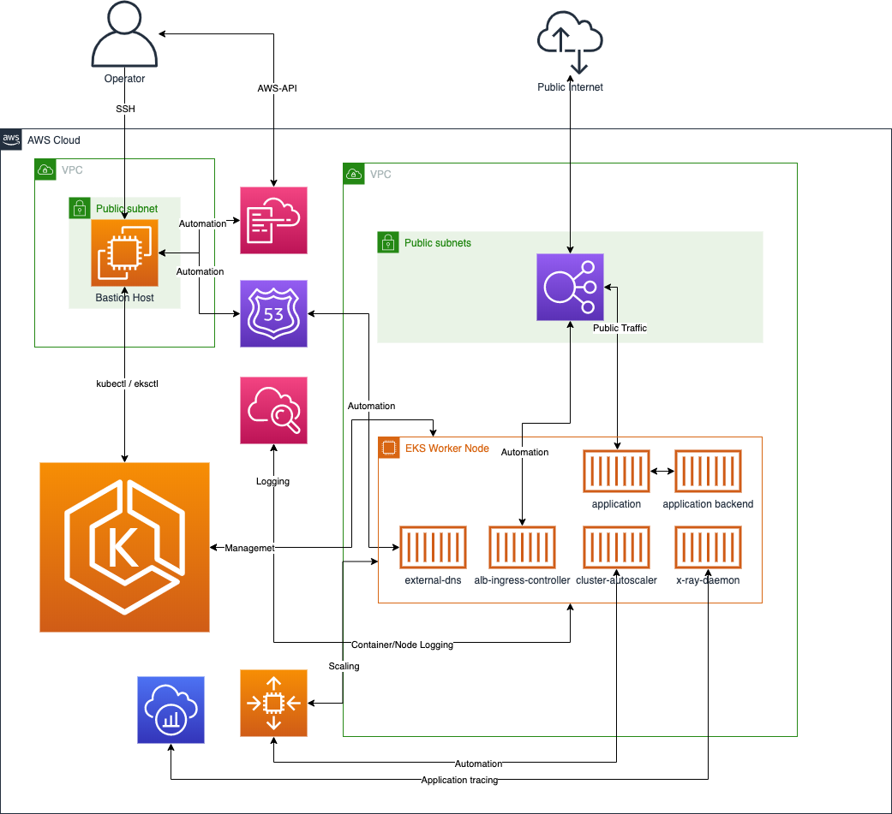

***Status:** Work-in-progress. Please create issues or pull requests if you have ideas for improvement.*

# **Amazon EKS full automated deployment with Ansible**
Example deployment of Amazon EKS using Ansible and Cloudformation.

## Summary
This project demonstrates the deployment of an Amazon EKS cluster and basic services using Ansible and Amazon Cloudformation. The deployment is fully automated and will enable you to start learing and testing the elasticity and agility of AWS Services used with Kubernetes based microservice architectures. 

## High-Level Architecture



## Disclaimer
This project is an example of an deployment and meant to be used for testing and learning purposes only. Do not use in production.

**Be aware that the deployment is not covered by the AWS free tier. Please use the [AWS pricing calculator](https://calculator.aws/#/estimate) to an estimation beforehand**

# Table of Contents

1. [Getting started](#Getting-started)
2. [Prerequisites](#Prerequisites)
3. [Parameters](#Parameters)
4. [Templates](#Templates)
5. [Testing](#Testing)
6. [Resources](#Resources)
7. [Security](#Security)
8. [License](#License)

# Getting started

Just a few steps are needed to get started with the example deployment. 
the deployment process is seperated in a cluster deployment containing the creation of the Amazon EKS cluster itself and various cluster extensions and optional demo/example deployments to show the Amazon EKS cluster and the extensions in action. 

You may use the [deployment playbook](./eks-deploy-cluster.playbook.yaml) for the [automatic deployment](#automatic) of Amazon EKS via Ansible. To destroy/remove the Amazon EKS deployment from your AWS Account you can use the [destroy playbook](./eks-destroy-cluster.playbook.yaml). 

## Prerequisites

To run the Ansible based deployment you need to have some software installed and configured on your device: 

- bash (zsh, csh, sh should also work, not tesed though)
- an [installed and configured ](https://docs.aws.amazon.com/cli/latest/userguide/cli-chap-install.html) aws-cli
- [a named profile](https://docs.aws.amazon.com/cli/latest/userguide/cli-configure-profiles.html) at the aws-cli configuration reflecting the account you are planning to use for the deployment
- [jq](https://stedolan.github.io/jq/)
- a working [Ansible installation](https://docs.ansible.com/ansible/latest/installation_guide/intro_installation.html) 
- an install of the community kubernetes [Ansible module](https://github.com/ansible-collections/community.kubernetes)
- some pip modules: botocore boto boto3

For the DNS Automation to work you'll need to have a [Hosted Zone](https://docs.aws.amazon.com/Route53/latest/DeveloperGuide/AboutHZWorkingWith.html) setup at your AWS Account

## Parameters

**Deployment parameters:**

Some static deployment variables are to be altered/placed into the [vars/static/definitions.yaml](vars/static/definitions.yaml)

| Parameter Name | Default Value | Description | Comment |
| ---- | ---- | ---- | ---- |
| eksexample_region | eu-central-1 | the region to be used for deployments | define the region to be used. Please be aware that the Amazon EKS on AWS Fargate used in some examples is not available in all [regions](https://docs.aws.amazon.com/eks/latest/userguide/fargate.html)
| eksexample_worker_desiredcount | 2 | desired worker nodes to start with | 
| eksexample_worker_maxcount | 10 | maximum workers to be provisoned if scaling out the cluster |
| eksexample_worker_mincount | 2 | minimum worker nodes | i recommend at least 2 |
| eksexample_worker_instancetype | t3a.medium | instance size of the worker nodes |
| eksexample_bastion_instancetype | t3a.small | instance size of the bastion host |
| eksexample_clustername | ansible-eks-testcluster | name of the Amazon EKS cluster |
| eksexample_clusterversion | 1.18 | version of the Amazon EKS cluster | versions <1.16 are not tested with this automation
| eksexample_aws_profilename | ansible | the [profile name setup](https://docs.aws.amazon.com/cli/latest/userguide/cli-configure-profiles.html) for the local awscli | i recommend to setup a local profile. if you decide to shift it directly to instance_profile based EC2 admin instances, alter the ansible module parameters to not use "profile:" 

rename the [vars/static/custom_definitions.yaml](vars/static/custom_definitions.yaml.example) and alter the parameters according to your needs
| Parameter Name | Default Value | Description | Comment |
| ---- | ---- | ---- | ---- |
| eksexample_hostedzoneid |  | the ID of your Route53 Zone where the DNS automation should work on. |
| eksexample_hostedzonename |  | the Domainname of the Hosted Zone on Route53 | 


# Deployment

The deployment will take approx 30-45 minutes. 

# Template structure and deployment workflow

The Deployment consists of one main playbook triggering multible tasks, cloudformation templates and kubernetes manifests

## Playbooks

- eks-deploy-cluster.playbook.yaml: this playbook starts the overall deployment of the Amazon EKS cluster and triggers also the deployment of all extensions. can be started with ansible-playbook ./eks-deploy-cluster.playbook.yaml
- eks-destroy-cluster.playbook.yaml: this playbook destroys the whole deployment. If you deployed the example deployments into the cluster, make sure these get destroyed first using the ./docs/examples/destroy-examples.playbook.yaml playbook. 
- ./docs/examples/deploy-examples.playbook.yaml: this playbook will deploy some microservice and overall deployment examples to demonstrate the functionality of the extensions. 
- ./docs/examples/destroy-examples.playbook.yaml: will remove the example deployments from the cluster (but leaves the cluster intact)

## Tasks
- acm.tasks.yaml: Sets up ACM and adds the validation Records into the defined Hosted Zone. 
- bastion.tasks.yaml: Sets up a Bastion Hosts used for the Amazon EKS deplyoment as well as all Kubernetes Deployments. Using the Bastion we'll not have to expose any ports/services of the Amazon EKS cluster backend to public internet.
- eks-cluster.task.yaml: deploys the Amazon EKS cluster and enables the logging for the masterplane 
- eks-cluster-autoscaler.task.yaml: setup of the [cluster-autoscaler](https://github.com/kubernetes/autoscaler/tree/master/cluster-autoscaler)
- eks-container-insights.task.yaml: enable [container insights](https://docs.aws.amazon.com/AmazonCloudWatch/latest/monitoring/ContainerInsights.html) for the Amazon EKS cluster
- eks-external-dns.task.yaml: setup of the Route53 automation via [external-dns](https://github.com/kubernetes-sigs/external-dns)
- eks-ingress-controller.task.yaml: setup of the [aws-load-balancer-controller](https://github.com/kubernetes-sigs/aws-load-balancer-controller) to automate service exposure
- eks-metrics-server.task.yaml: setup of the metrics server used by the [Horizontal Pod Autoscaler](https://kubernetes.io/de/docs/tasks/run-application/horizontal-pod-autoscale/)
- eks-storage-provider-ebscsi.task.yaml: setup of the [Amazon Elastic Block Store (EBS) CSI driver](https://github.com/kubernetes-sigs/aws-ebs-csi-driver). The driver will ensure automatic provisioning of persistent block storage volumes for workloads
- eks-storage-provider-efscsi.task.yaml: setup of the [Amazon EFS CSI driver](https://github.com/kubernetes-sigs/aws-efs-csi-driver). The driver will ensure automatic provisioning of persistent shared storage volumes for workloads
- eks-xray.task.yaml: setup of the [X-Ray deamon setup](https://github.com/aws-samples/aws-xray-kubernetes) to trace application deployments

## Cloudformation Templates
- eks-bastion.template.yaml
- eks-cluster-autoscaler-iam.template.yaml: provisioning of the IAM Policy granting access for the cluster autoscaler to Amazon EC2 and EC2 Autoscaling groups. 
- eks-container-insights-iam.template.yaml: provisioning of the IAM Policy allowing Amazon Cloudwatch Access via the Worker Nodes
- eks-external-dns-iam.template.yaml: provisioning of the IAM Policy granting access for the external-dns pods to Route53
- eks-ingress-controller-iam.template.yaml: provisioning of the IAM Policy granting access for the aws-load-balancer-controller towards Elastic Load Balancing
- eks-storage-provider-ebscsi-iam.template.yaml: IAM Policies to Allow EBS Access via the CSI Driver Deployment
- eks-storage-provider-efscsi-storage.template.yaml: provisioning of the EFS FileSystem, Mountpoints and related Securitygroups

## Kubernetes Manifests

All Manifests used for the Kubernetes Service and Application deployments are seperated into subfolders of either [./k8s/](./k8s) or [./docs/examples/k8s](./docs/examples/k8s)
These Manifests are triggered using the community.kubernetes modules via the Ansible tasks. 

## additional Files
- [ansible.cfg](./ansible.cfg): contains some tweaks for the SSH connectivity, logging and so on. 
- ansible.log: will be written on each run but not checked into the git repo (-> [.gitignore](.gitignore) )
- [./vars/dynamic/*.yaml](./vars/dynamic): Variable files written by the playbooks. Contain information about SSL Arns and Bastion Host IP/Name Details.  
- [./secrets/id_rsa_eks](./secrets/id_rsa_eks): this file contains the private ssh key to log into the bastion host via SSH. this is used by the Ansible playbooks but may be also used by you to log into the bastion to do some testing. this file will not be checked into git (-> [.gitignore](.gitignore) )
---
# Testing

When the deployment of the cluster is fullfilled you may test your setup. some useful commands to see what actually got deployed: 

first of all you should log into your bastion host. from there you will find a ready to use kubeconfig within [.kube/config](.kube/config)

to see if nodes are there and your access to the Amazon EKS cluster is working type: 
```
kubectl get nodes
```

should give you something like: 
```
NAME                                              STATUS   ROLES    AGE   VERSION
ip-192-168-43-140.eu-central-1.compute.internal   Ready    <none>   15m   v1.17.9-eks-4c6976
ip-192-168-93-136.eu-central-1.compute.internal   Ready    <none>   15m   v1.17.9-eks-4c697
```

to see if the pods of the extensions are up and running you may use: 
```
kubectl get pod -o=wide -n kube-system
```

which should show something like: 
```
NAME                                      READY   STATUS    RESTARTS   AGE     IP               NODE                                              NOMINATED NODE   READINESS GATES
aws-load-balancer-controller-7568799df8-pnch4   1/1     Running   0          7m30s   192.168.45.158   ip-192-168-43-140.eu-central-1.compute.internal   <none>           <none>
aws-node-7vg6h                            1/1     Running   0          17m     192.168.93.136   ip-192-168-93-136.eu-central-1.compute.internal   <none>           <none>
aws-node-scl29                            1/1     Running   0          17m     192.168.43.140   ip-192-168-43-140.eu-central-1.compute.internal   <none>           <none>
cluster-autoscaler-7884f5ff6d-k6vpw       1/1     Running   0          8m44s   192.168.68.113   ip-192-168-93-136.eu-central-1.compute.internal   <none>           <none>
coredns-5fdf64ff8-7m4bd                   1/1     Running   0          21m     192.168.70.235   ip-192-168-93-136.eu-central-1.compute.internal   <none>           <none>
coredns-5fdf64ff8-cnwlc                   1/1     Running   0          21m     192.168.52.7     ip-192-168-43-140.eu-central-1.compute.internal   <none>           <none>
ebs-csi-controller-668bbc964-2ttdt        4/4     Running   0          13m     192.168.88.219   ip-192-168-93-136.eu-central-1.compute.internal   <none>           <none>
ebs-csi-controller-668bbc964-pt8n4        4/4     Running   0          13m     192.168.41.152   ip-192-168-43-140.eu-central-1.compute.internal   <none>           <none>
ebs-csi-node-qq5r8                        3/3     Running   0          13m     192.168.43.140   ip-192-168-43-140.eu-central-1.compute.internal   <none>           <none>
ebs-csi-node-zsxs9                        3/3     Running   0          13m     192.168.93.136   ip-192-168-93-136.eu-central-1.compute.internal   <none>           <none>
ebs-snapshot-controller-0                 1/1     Running   0          13m     192.168.32.10    ip-192-168-43-140.eu-central-1.compute.internal   <none>           <none>
efs-csi-node-dzz5j                        3/3     Running   0          11m     192.168.93.136   ip-192-168-93-136.eu-central-1.compute.internal   <none>           <none>
...
```

you can check if for instance the ingress-controller is working as expected using: 
```
kubectl logs -n kube-system $(kubectl get po -n kube-system | egrep -o alb-ingress[a-zA-Z0-9-]+)
```

if everything is cool it should look like: 
```
-------------------------------------------------------------------------------
AWS ALB Ingress controller
  Release:    v1.1.8
  Build:      git-ec387ad1
  Repository: https://github.com/kubernetes-sigs/aws-load-balancer-controller.git
-------------------------------------------------------------------------------

W0813 14:32:48.050307       1 client_config.go:549] Neither --kubeconfig nor --master was specified.  Using the inClusterConfig.  This might not work.
I0813 14:32:48.096117       1 controller.go:121] kubebuilder/controller "level"=0 "msg"="Starting EventSource"  "controller"="aws-load-balancer-controller" "source"={"Type":{"metadata":{"creationTimestamp":null}}}
I0813 14:32:48.096518       1 controller.go:121] kubebuilder/controller "level"=0 "msg"="Starting EventSource"  "controller"="aws-load-balancer-controller" "source"={"Type":{"metadata":{"creationTimestamp":null},"spec":{},"status":{"loadBalancer":{}}}}
I0813 14:32:48.096622       1 controller.go:121] kubebuilder/controller "level"=0 "msg"="Starting EventSource"  "controller"="aws-load-balancer-controller" "source"=
I0813 14:32:48.096910       1 controller.go:121] kubebuilder/controller "level"=0 "msg"="Starting EventSource"  "controller"="aws-load-balancer-controller" "source"={"Type":{"metadata":{"creationTimestamp":null},"spec":{},"status":{"loadBalancer":{}}}}
I0813 14:32:48.096963       1 controller.go:121] kubebuilder/controller "level"=0 "msg"="Starting EventSource"  "controller"="aws-load-balancer-controller" "source"=
I0813 14:32:48.097188       1 controller.go:121] kubebuilder/controller "level"=0 "msg"="Starting EventSource"  "controller"="aws-load-balancer-controller" "source"={"Type":{"metadata":{"creationTimestamp":null}}}
I0813 14:32:48.098011       1 controller.go:121] kubebuilder/controller "level"=0 "msg"="Starting EventSource"  "controller"="aws-load-balancer-controller" "source"={"Type":{"metadata":{"creationTimestamp":null},"spec":{},"status":{"daemonEndpoints":{"kubeletEndpoint":{"Port":0}},"nodeInfo":{"machineID":"","systemUUID":"","bootID":"","kernelVersion":"","osImage":"","containerRuntimeVersion":"","kubeletVersion":"","kubeProxyVersion":"","operatingSystem":"","architecture":""}}}}
I0813 14:32:48.103658       1 controller.go:121] kubebuilder/controller "level"=0 "msg"="Starting EventSource"  "controller"="aws-load-balancer-controller" "source"={"Type":{"metadata":{"creationTimestamp":null},"spec":{"containers":null},"status":{}}}
I0813 14:32:48.105447       1 leaderelection.go:205] attempting to acquire leader lease  kube-system/ingress-controller-leader-alb...
I0813 14:32:48.119414       1 leaderelection.go:214] successfully acquired lease kube-system/ingress-controller-leader-alb
I0813 14:32:48.119775       1 recorder.go:53] kubebuilder/manager/events "level"=1 "msg"="Normal"  "message"="aws-load-balancer-controller-7568799df8-pnch4_dc09d9d6-dd71-11ea-a82f-6e94ec7ac6f2 became leader" "object"={"kind":"ConfigMap","namespace":"kube-system","name":"ingress-controller-leader-alb","uid":"5e3275ce-3936-411a-9de5-4503c2223c8b","apiVersion":"v1","resourceVersion":"3156"} "reason"="LeaderElection"
I0813 14:32:48.222253       1 controller.go:134] kubebuilder/controller "level"=0 "msg"="Starting Controller"  "controller"="aws-load-balancer-controller"
I0813 14:32:48.322547       1 controller.go:154] kubebuilder/controller "level"=0 "msg"="Starting workers"  "controller"="aws-load-balancer-controller" "worker count"=1
```
if you replace *alb-ingress* with *external-dns* or *cluster-autoscaler* you can use the same command to get the logs of these extensions as well. 

## Testing the example deployments

if you deployed the example(s) via [./docs/examples/deploy-examples.playbook.yaml](./docs/examples/deploy-examples.playbook.yaml) you can check some neat details. 

to check the Horizontal Pod Autscaler coming with the example-microservice use: 

```
watch -n 1 kubectl get hpa -n eksdemo
```
which will give you: 
```
NAME               REFERENCE                     TARGETS         MINPODS   MAXPODS   REPLICAS   AGE
eksdemo-crystal    Deployment/eksdemo-crystal    1%/30%   2         10        1          17s
eksdemo-frontend   Deployment/eksdemo-frontend   3%/30%   2         10        0          14s
eksdemo-nodejs     Deployment/eksdemo-nodejs     2%/30%   2         10        1          20s
```

then open the test webpage using your browser of choise. the web address will be "https://eksdemo. + what you used for the variable "eksexample_hostedzonename"
open the page on multiple tabs should generate some load you'll recordnize. 
you also can use for instance curl as a load generator 

```
watch -n 0.1 curl -v https://eksdemo.example.com
```

There are many other things to try out. Feel free to share your ideas :) 

---
# Resources

- AWS Services
    - [Amazon Cloudformation](https://aws.amazon.com/cloudformation/)
    - [Amazon EKS](https://aws.amazon.com/ec2/)
    - [AWS Certificate Manager](https://aws.amazon.com/certificate-manager/)
    - [Amazon Cloudwatch](https://aws.amazon.com/cloudwatch/)
    - [Amazon Route53](https://aws.amazon.com/route53/)
    - [Elastic Load Balancing](https://aws.amazon.com/elasticloadbalancing/)
    - [Amazon EC2 Auto Scaling](https://aws.amazon.com/ec2/autoscaling/)
    - [Amazon Virtual Private Cloud](https://aws.amazon.com/vpc/)
    - [Amazon Elastic File Service](https://aws.amazon.com/efs/)

- Open Source Projects
    - [Ansible](https://github.com/ansible/ansible)
    - [Kubectl](https://kubernetes.io/docs/reference/kubectl/kubectl/)
    - [eksctl](https://github.com/weaveworks/eksctl)
    - [cluster-autoscaler](https://github.com/kubernetes/autoscaler/tree/master/cluster-autoscaler)
    - [external-dns](https://github.com/kubernetes-sigs/external-dns)
    - [aws-load-balancer-controller](https://github.com/kubernetes-sigs/aws-load-balancer-controller)
    - [Horizontal Pod Autoscaler](https://kubernetes.io/de/docs/tasks/run-application/horizontal-pod-autoscale/)
    - [Amazon EFS CSI driver](https://github.com/kubernetes-sigs/aws-efs-csi-driver)
    - [Amazon Elastic Block Store (EBS) CSI driver](https://github.com/kubernetes-sigs/aws-ebs-csi-driver)

# Security

See [CONTRIBUTING](CONTRIBUTING.md#security-issue-notifications) for more information.

# License

This Example is licensed under the MIT-0 License. See the LICENSE file.

Individual files may contain code by other authors under other
licenses.  See their license headers for details.